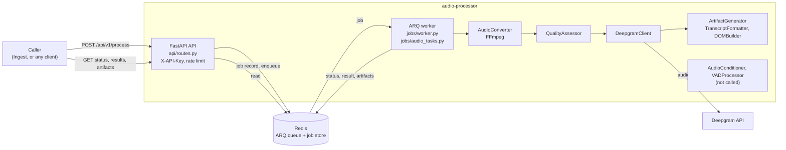

Level 1 shows the components inside Prepare-Audio (`audio-processor`), taken from the code in `src/audio_processor/`.
Context is on [Level 0](../level-0/index.md). Status below describes the code, not the plans.

## Components

## Data flow

1. `POST /api/v1/process` takes a multipart upload (`file`, `enable_diarization`, `enable_summarization`, `language`,
   `callback_url`). The API streams it to a temp file, validates it with `AudioConverter.validate_file`, stores a job
   record in Redis, and returns 202 with a job ID. Every route under `/api/v1` requires an `X-API-Key` header.
2. The ARQ worker (`process_audio_job`) converts the audio with FFmpeg, runs `QualityAssessor`, and transcribes with
   Deepgram (skipped with a warning if no API key is configured).
3. `ArtifactGenerator` builds `docling_dom.json`, `transcript.txt`, `transcript_simple.txt`, `transcript.srt`, and
   `transcript.vtt`. `TranscriptFormatter` and `DOMBuilder` are therefore reached through `ArtifactGenerator`.
4. State, result, and artifact text are written to the Redis job store. Clients poll `GET /api/v1/status/{job_id}`,
   then read `GET /api/v1/results/{job_id}` and `GET /api/v1/artifacts/{job_id}/{artifact_name}`.

## Inputs and outputs

| Direction | Today (code) | Pipeline contract |
| --- | --- | --- |
| Input | HTTP multipart upload | Audio or video from `{trace_id}/00-source/` in object storage |
| Output | Docling DOM and transcript text artifacts served over HTTP from Redis | `TranscriptMetadata.json` in `{trace_id}/02-transcribed/`, with `source_track: "audio"` and the pre-assembled DOM |
| Status | Polling endpoints | Callback to Ingest |

Contracts: `ingest-prepare-audio-contract.md` and `prepare-audio-unify-contract.md` in
[image-preprocessing-detector](https://github.com/williaby/image-preprocessing-detector) under
`docs/development/RAG Pipeline/`.

## Interface-contract mismatch (noted, not fixed here)

- The Ingest contract expects Prepare-Audio to call back to a `rag-processor` route
  `/api/v1/jobs/{trace_id}/status`. `rag-processor` does not have that route, and this service has no `trace_id`.
- `callback_url` is a free-form webhook field. It is accepted and stored on the job input, but a search of `src/`
  finds no code that sends a request to it.
- The service reads uploads over HTTP and keeps results in Redis. It does not read from `00-source/` or write
  `02-transcribed/`, and no code produces `TranscriptMetadata.json`.

## Status

| Component | Status | Evidence |
| --- | --- | --- |
| API with X-API-Key auth, rate limit, upload cap | Built | `api/routes.py`, `api/security.py` |
| ARQ worker and Redis job store | Built | `jobs/`, `core/job_store.py` |
| FFmpeg conversion, quality assessment | Built | called in `jobs/audio_tasks.py` |
| Deepgram transcription with diarization | Built | `services/deepgram_client.py` |
| Transcript formats and Docling DOM | Built | via `ArtifactGenerator` |
| `AudioConditioner`, `VADProcessor` | Built, not wired | no callers in `src/`; ADR-002 expects them before ASR (audit ARCH-03) |
| `callback_url` delivery | Not built | field stored only |
| `TranscriptMetadata.json` | Not built | no producer in `src/` |
| Object storage I/O (`00-source/`, `02-transcribed/`) | Not built | no storage client in `src/` |
| Ingest status callback, `trace_id` | Not built | see mismatch above |

The audit in `docs/audit/2026-05-29/00-final-report.md` lists `DOMBuilder` and `TranscriptFormatter` as having no
production callers. The code now reaches both through `ArtifactGenerator`, so only the conditioner and VAD remain
unwired. The audit finding SEC-01 (no API authentication) is also out of date: `api/security.py` now enforces
`X-API-Key`. Treat SEC-01 and ARCH-03 as partly superseded by this page.
